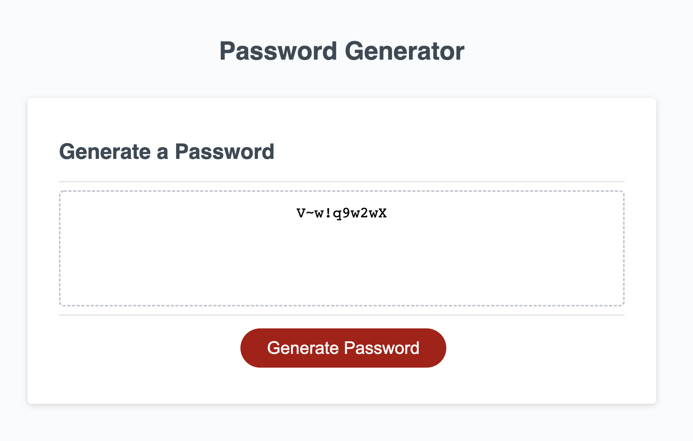

# Password-Generator

Project now creates a random, and secure password when I click the button to generate a password.
It begins with a series of prompts for password criteria.
When prompted for the length of the password, you can choose a length of at least 8 characters and no more than 128 characters.
A password will be generated that matches thw selected criteria.

## Links
   [Password Generator](https://stephrrcodes.github.io/Password-Generator/)

## Screenshot

## Author
The original author is 
- [Xandromus](https://github.com/Xandromus)
